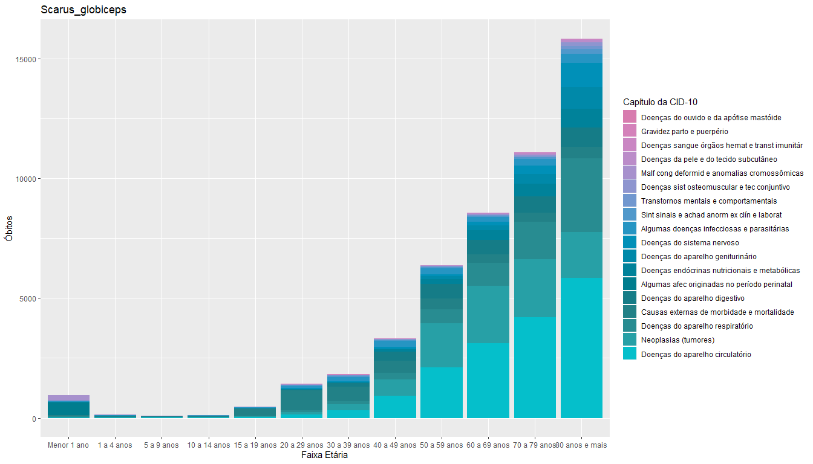

Color scales in action
================

This is an example of my favorite color scales applied to the same
graph:

**Número de óbitos residentes, por faixa etária e Capítulo da CID-10,
Santo André, 2008-2017**

<!-- --><!-- --><!-- --><!-- --><!-- --><!-- --><!-- --><!-- --><!-- --><!-- --><!-- --><!-- --><!-- --><!-- --><!-- --><!-- --><!-- --><!-- --><!-- --><!-- --><!-- --><!-- --><!-- --><!-- --><!-- --><!-- --><!-- --><!-- --><!-- -->
